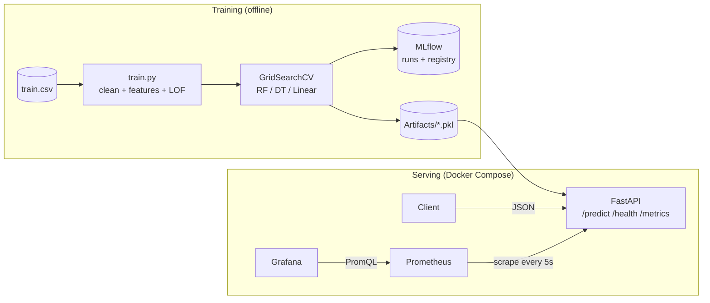

# 🏠 House Price Prediction: End-to-End MLOps Project

> From a Jupyter notebook to a **packaged, tracked, containerized and monitored** machine learning service.


A regression service that predicts house prices (in lacs). The focus of this project is **not only the model**, but the full lifecycle around it: reproducible training, experiment tracking, model registry, a production-style REST API, containerization and live monitoring.

---

## ✨ What this project demonstrates

| MLOps skill | How it is done here |
|---|---|
| **Notebook → package** | Modular `src/` layout: config, training, prediction, controllers and API layers, managed with `uv` and `pyproject.toml` |
| **Reproducible training pipeline** | One class runs load → clean → feature engineering → outlier removal → split → tune → save |
| **Hyperparameter tuning** | `GridSearchCV` (3-fold CV, R² scoring) across 3 model families |
| **Experiment tracking** | MLflow with a SQLite backend, nested runs (parent run plus one child per model), logged params and metrics |
| **Model registry** | Best model (by test R²) is registered as `house_price_regressor` |
| **Artifact management** | Model, scaler, encoders and KMeans saved with `joblib` and versioned separately from code |
| **Serving** | FastAPI with Pydantic input validation, clear HTTP error codes and a singleton model loader |
| **Training/serving consistency** | The inference path rebuilds the exact training features, in the same column order |
| **Containerization** | Dockerfile with cached dependency layers, orchestrated with Docker Compose |
| **Monitoring** | Prometheus scrapes the API, and Grafana visualizes latency, traffic, errors and prediction distribution |

---

## 🏗️ Architecture



**Layered code structure**

```
Request → views (routes) → controllers (business logic) → models (predict / schemas)
```

---

## 📁 Project structure

```
House_Price_Prediction/
├── Artifacts/                  # saved model, scaler, encoders, KMeans (.pkl)
├── Data/                       # train.csv
├── grafana/provisioning/       # Grafana datasource config (as code)
├── prometheus/prometheus.yml   # scrape config
├── src/house_price/
│   ├── config.py               # central settings (paths, MLflow, API)
│   ├── main.py                 # FastAPI app + Prometheus instrumentation
│   ├── metrics.py              # custom ML metrics
│   ├── controllers/
│   │   └── model_controller.py # loads artifacts, orchestrates prediction
│   ├── models/
│   │   ├── train.py            # training + tuning + MLflow logging
│   │   ├── predict.py          # inference pipeline
│   │   └── schemas.py          # Pydantic request/response models
│   └── views/
│       └── api.py              # API routes
├── Dockerfile
├── docker-compose.yml
├── pyproject.toml
└── uv.lock
```

---

## 🧪 ML pipeline

1. **Cleaning:** drop duplicates, extract `Area` and `city` from the address.
2. **Feature engineering:** KMeans (10 clusters) on latitude/longitude creates **location tiers**, which are one-hot encoded.
3. **Encoding:** `LabelEncoder` for categorical fields.
4. **Outlier removal:** `LocalOutlierFactor` (contamination = 0.1) on numeric features.
5. **Scaling:** `StandardScaler`, fit on the training split only, to avoid leakage.
6. **Model selection:** hyperparameters are tuned with `GridSearchCV` (cv = 3, scoring = R²).

| Model | Tuned parameters |
|---|---|
| Random Forest | `n_estimators` [100, 200], `max_depth` [None, 10, 20], `min_samples_split` [2, 5] |
| Decision Tree | `max_depth` [None, 10, 20], `min_samples_split` [2, 5] |
| Linear Regression | baseline |

The best model is chosen by **test R²**, saved to `Artifacts/` and registered in the MLflow Model Registry.

### Results

<!-- Replace with your real numbers from the MLflow UI -->
| Model | CV R² | Test R² | Test MSE |
|---|---|---|---|
| Random Forest | 0.905 | 0.887 | 33664.53 |
| Decision Tree | 0.901 | 0.860 | 41446.87 |
| Linear Regression | 0.754 | 0.729 | 80346.98 |

---

## 📊 Experiment tracking with MLflow

- SQLite backend (`mlflow.db`) with a **parent run** for the pipeline and a **nested child run per model**.
- Logged per model: best hyperparameters, `mse`, `r2`, `cv_score` and the fitted model.
- The winning model is registered as **`house_price_regressor`**.

```bash
uv run mlflow ui --backend-store-uri sqlite:///mlflow.db
# open http://127.0.0.1:5000
```

<!--  -->

---

## 🚀 Quick start

### Prerequisites
Python 3.12, [uv](https://docs.astral.sh/uv/), Docker Desktop.

### 1. Install

```bash
git clone https://github.com/<your-username>/<your-repo>.git
cd <your-repo>
uv sync
```

### 2. Train and save the model
Place the dataset at `Data/train.csv`, then run:

```bash
uv run python -m house_price.models.train
```

This creates the `.pkl` files in `Artifacts/` and logs the experiment to MLflow.

### 3a. Run the API locally

```bash
uv run uvicorn house_price.main:app --reload --app-dir src
```

### 3b. Run the full stack with Docker (API + Prometheus + Grafana)

```bash
docker compose up -d --build
```

| Service | URL |
|---|---|
| API docs (Swagger) | http://localhost:8000/docs |
| Raw metrics | http://localhost:8000/metrics |
| Prometheus | http://localhost:9090 |
| Grafana | http://localhost:3000 |

---

## 🔌 API

### `POST /api/v1/data/predict`

```bash
curl -X POST http://localhost:8000/api/v1/data/predict \
  -H "Content-Type: application/json" \
  -d '{
    "POSTED_BY": "Dealer",
    "UNDER_CONSTRUCTION": 0,
    "RERA": 0,
    "BHK_NO": 2,
    "BHK_OR_RK": "BHK",
    "SQUARE_FT": 900,
    "READY_TO_MOVE": 0,
    "RESALE": 1,
    "LATITUDE": 12.852171,
    "LONGITUDE": 80.216826,
  }'
```

```json
{ "predicted_price": 60.31 }
```

| Endpoint | Purpose |
|---|---|
| `GET /api/v1/health` | Service health and version |
| `POST /api/v1/data/predict` | Price prediction |
| `GET /metrics` | Prometheus metrics |

| Status | Meaning |
|---|---|
| 200 | Prediction returned |
| 422 | Invalid input (schema or unknown category) |
| 503 | Model artifacts not found. Train the model first |

**Production-minded details**
- Pydantic validates every request.
- The controller is created once with `lru_cache`, so artifacts load a single time and not on every request.
- Errors map to proper HTTP status codes.
- Inference rebuilds the same features as training (location tier via the saved KMeans, encoders, scaler column order), which prevents training/serving skew.

---

## 📈 Monitoring: Prometheus + Grafana

Prometheus scrapes `/metrics` every 5 seconds, and Grafana reads from Prometheus through a provisioned datasource (configuration as code).

### Metrics

| Metric | Type | Purpose |
|---|---|---|
| `http_requests_total` | Counter | Traffic and status codes per endpoint |
| `http_request_duration_seconds` | Histogram | API latency |
| `house_price_predictions_total{status}` | Counter | Successful vs failed predictions |
| `house_price_prediction_seconds` | Histogram | Model inference time |
| `house_price_predicted_lacs` | Histogram | Distribution of predicted prices (a **data drift** signal) |
| `house_price_model_loaded` | Gauge | Whether the model artifacts are loaded |
| `up`, `process_*` | Gauge | Service health, CPU and memory |

### Dashboard panels

| Panel | PromQL |
|---|---|
| Requests per second | `sum by (handler) (rate(http_requests_total[$__rate_interval]))` |
| Prediction error % | `100 * sum(rate(house_price_predictions_total{status="error"}[$__rate_interval])) / sum(rate(house_price_predictions_total[$__rate_interval]))` |
| p95 inference time | `histogram_quantile(0.95, sum by (le) (rate(house_price_prediction_seconds_bucket[$__rate_interval])))` |
| Average predicted price | `rate(house_price_predicted_lacs_sum[$__rate_interval]) / rate(house_price_predicted_lacs_count[$__rate_interval])` |

<!--  -->

---

## 🐳 Docker design decisions

- **Layer caching:** dependencies are installed before the source is copied, so code changes rebuild in seconds.
- **Models are mounted, not baked in:** `./Artifacts` is a read-only volume, so retraining needs only `docker compose restart api`.
- **Persistent monitoring data:** named volumes keep Prometheus history and Grafana dashboards.
- **Internal networking:** services reach each other by name (`api:8000`, `prometheus:9090`).

---

## 🗺️ From notebook to MLOps

| Notebook stage | This project |
|---|---|
| Cells run in order by hand | Reproducible pipeline class with one entry point |
| Hard-coded paths | Central `Settings` config |
| Manual comparison of results | Nested MLflow runs and a model registry |
| `model.pkl` somewhere on disk | Versioned artifact set (model + scaler + encoders + KMeans) |
| `model.predict()` in a cell | Validated REST API with error handling |
| "It works on my machine" | Dockerized stack with Compose |
| No visibility after deployment | Prometheus metrics and Grafana dashboards |

---

## 🔭 Roadmap

- [ ] CI pipeline (GitHub Actions): lint, tests, Docker build
- [ ] Unit and API tests with `pytest`
- [ ] Alerting with Alertmanager (API down, high error rate, slow inference)
- [ ] Data drift detection (for example Evidently) against the training distribution
- [ ] Load model from the MLflow Model Registry instead of local pickles
- [ ] Data and model versioning with DVC
- [ ] Deploy to a cloud service

---

## 🧰 Tech stack

Python · pandas · scikit-learn · joblib · MLflow · FastAPI · Pydantic · Uvicorn · uv · Docker · Docker Compose · Prometheus · Grafana

---

## 👤 Author

**<Your Name>**
[LinkedIn](https://www.linkedin.com/in/sara-ibrahim-omran) · [GitHub](https://github.com/sara692)
